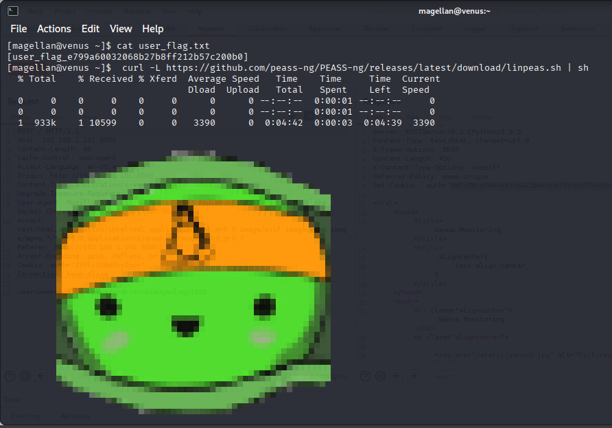
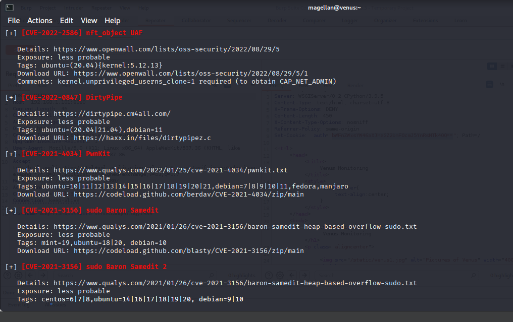
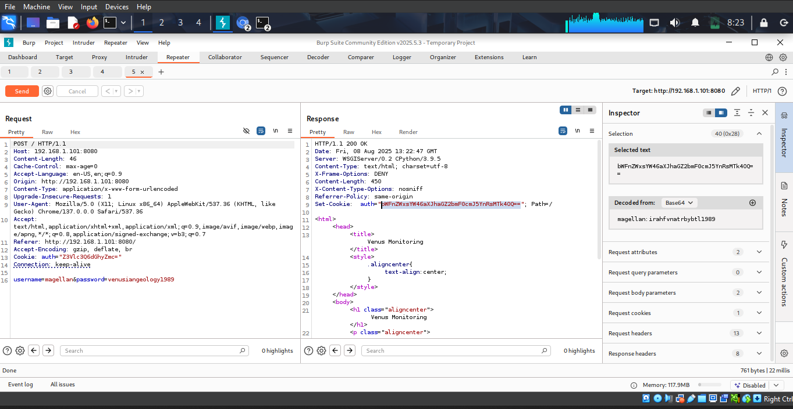

## Vulnerability Assessment and Penetration Testing (VAPT) Report

### Engagement: X Company — Venus and Napping (VulnHub)
Date: 2025-08-09
Prepared by: Nibishaka thoti Pacifique

---

## Table of Contents 📚

- [1. Web Application Penetration Testing](#web-app-pt)
  - [1.1 Executive Summary 📝](#web-app-pt-1-1)
  - [1.2 Background 🧭](#web-app-pt-1-2)
  - [1.3 Objectives 🎯](#web-app-pt-1-3)
  - [1.4 Scope of Assessment 🗺️](#web-app-pt-1-4)
  - [1.5 Out of Scope 🚫](#web-app-pt-1-5)
  - [1.6 Tools Used 🧰](#web-app-pt-1-6)
- [Executive Summary 📄](#exec-summary)
- [Scope and Objectives 🎯](#scope-objectives)
  - [In-Scope Assets](#in-scope-assets)
  - [Objectives](#objectives-main)
  - [Constraints and Assumptions](#constraints-assumptions)
- [Target Overview 🔎](#target-overview)
- [Methodology 🔧](#methodology)
  - [Approach](#approach)
  - [Tools and Techniques](#tools-techniques)
- [Findings — Venus 🛡️](#findings-venus)
- [Findings — Napping 🛡️](#findings-napping)
- [Risk Prioritization ⚠️](#risk-prioritization)
- [Remediation Roadmap 🛠️](#remediation-roadmap)
- [Conclusion ✅](#conclusion)
- [Appendix A — Evidence Gallery 🖼️](#appendix-a)
- [Appendix B — Testing Log 🧪](#appendix-b)
- [Appendix C — References 📚](#appendix-c)

---

## 1. Web Application Penetration Testing

### 1.1 Executive Summary 📝

X Company engaged to conduct a black-box penetration test and vulnerability assessment. This report presents the results of a Vulnerability Assessment and Penetration Testing (VAPT) conducted on two virtual servers, *Venus* and *Napping*, hosted on VulnHub. The goal was to assess potential security weaknesses, simulate realistic attack scenarios, and propose targeted recommendations to strengthen system defenses. Multiple vulnerabilities were identified, ranging from misconfigurations and outdated software to privilege escalation paths. Key recommendations include patching, configuration hardening, and improved access controls.

### 1.2 Background 🧭

This exercise aimed to perform penetration testing of the servers in scope to determine if they were vulnerable to attacks and exploitation. The test consisted of manual testing to detect and exploit vulnerabilities. The assessment was conducted to identify the security vulnerabilities in the servers in scope, assess their potential impact, and provide detailed recommendations for remediation.

### 1.3 Objectives 🎯

**The objective of the tests performed was to:**

- Identify the possible vulnerabilities and gaps in the servers.
- Assess the gaps and vulnerabilities to determine the risk associated.
- Suggest recommendations to overcome existing vulnerabilities and gaps.

**This assessment report contains:**

- **Technical details** of the vulnerabilities discovered.
- **Risk mitigation recommendations** that need to be implemented to ensure that the systems are secure from the risks arising due to the discovered vulnerabilities.

### 1.4 Scope of Assessment 🗺️

**The scope for this security assessment includes the following tests:**

- Information gathering
- Authentication

**URLs 🔗**

- http://192.168.1.101
- http://192.168.1.197

**Environment Details 🖥️**

| Item | Value |
| --- | --- |
| Server Names | Venus, Napping |
| Environment | Production |
| Accessibility | Local |
| Venus IP | 192.168.1.101 |
| Venus MAC address | 08:00:27:18:54:5E |
| Napping IP | 192.168.1.197 |
| Napping MAC address | 08:00:27:49:EE:4D |
| Authentication Method | Login & SSH |

### 1.5 Out of Scope 🚫

**The following activities and applications were considered out of scope for this engagement:**

- Social engineering
- Denial of service
- Vulnerability fixes

### 1.6 Tools Used 🧰

The following tools were used for the testing:

- Burp Suite
- Nmap
- Gobuster
- Kali Linux
- Mozilla Firefox extensions

---

### Executive Summary

This engagement assessed two VulnHub-hosted servers — Venus and Napping — representative of X Company's environment. The assessment combined vulnerability assessment and penetration testing techniques to identify weaknesses, demonstrate exploitability, and provide actionable remediation guidance.

Key results:
- Both hosts exhibited authentication weaknesses enabling unauthorized access to administrative or user areas.
- Post-compromise, privilege escalation paths were identified, aided by local enumeration (e.g., LinPEAS) and insecure configurations.
- Evidence indicates sensitive information handling weaknesses (e.g., trivial encoding such as ROT13) and exposed administrative interfaces.

Overall risk: High. Multiple chained findings allow an attacker to gain initial access and escalate privileges.

---

## Scope and Objectives

### In-Scope Assets
- Venus: VulnHub target “The Planets: Venus”
- Napping: VulnHub target “Napping: 1.0.1”

### Objectives
- Identify vulnerabilities affecting confidentiality, integrity, and availability.
- Validate exploitability through controlled penetration testing.
- Provide remediation prioritized by risk.

### Constraints and Assumptions
- Testing conducted within VulnHub lab boundaries against Venus and Napping only.
- Network-layer details (IP/MAC) are evidenced via screenshots; exact values should be taken from embedded artifacts.

---

## Target Overview

The following screenshots document network discovery and target identification.

If required, MAC addresses and precise IPs should be read from the above evidence or the related recon screenshots.

Additional reconnaissance artifacts:

---

## Methodology

### Approach
- Passive and active recon to enumerate services, technologies, and attack surface.
- Vulnerability assessment via configuration review and manual verification.
- Exploitation to validate impact while minimizing service disruption.
- Post-exploitation enumeration to assess privilege escalation and data exposure.

### Tools and Techniques
- Network and service discovery (e.g., nmap, browser-based enumeration)
- Web attack tooling (e.g., Hydra/ffuf/gobuster, as applicable)
- Interception/proxy tooling (e.g., Burp Suite) for manual testing
- Local enumeration (e.g., LinPEAS)
- Manual analysis and custom scripts where appropriate

Evidence of tooling used:

---

## Findings — Venus

### V1. Exposed Administrative Interface (Authentication Weakness) — High
**Description**: A web administrative interface (e.g., Django admin) was exposed and accessible. Weak credentials allowed successful brute-force login.
**Evidence**:
- 
- 
- 
- 
**Impact**: Unauthorized administrative access; full application takeover possible.
**Likelihood**: High. Weak credentials allow remote exploitation.
**Remediation**:
- Enforce strong password policy and lockout/rate-limiting.
- Restrict admin interface by IP allowlisting/VPN/SSO.
- Enable multi-factor authentication (MFA) if supported.

### V2. Trivially Encoded Secrets (ROT13) — Medium
**Description**: Sensitive data or credentials observed protected only by ROT13 encoding.
**Evidence**:
- 
**Impact**: Low barrier to disclosure; facilitates further compromise.
**Likelihood**: High once discovered.
**Remediation**:
- Replace encoding with proper cryptographic hashing or encryption as appropriate.
- Remove secrets from client-side or easily retrievable locations.

### V3. Local Privilege Escalation via Insecure Configuration — High
**Description**: Post-compromise enumeration revealed misconfigurations enabling privilege escalation (e.g., writable service, SUID binary, misconfigured cron, or vulnerable package).
**Evidence**:
- 
- 
**Impact**: Elevation from low-privilege user to higher privileges up to root.
**Likelihood**: Medium–High depending on environment hardening.
**Remediation**:
- Remove unnecessary SUID/SGID bits; harden file/dir permissions.
- Patch vulnerable packages; restrict cron jobs; enforce least privilege.
- Implement EDR and alerting on suspicious privilege escalation behavior.

### V4. Sensitive Functionality/Endpoint Exposure — Medium
**Description**: Additional application endpoints and URLs were identified that increase attack surface and may leak information or enable abuse.
**Evidence**:
- 
- 
**Impact**: Information disclosure and potential pivot to higher-impact exploits.
**Likelihood**: Medium.
**Remediation**:
- Disable or protect non-essential endpoints.
- Enforce authorization checks and minimize verbose error output.

Additional Venus evidence and context:

---

## Findings — Napping

### N1. Weak Authentication on Web Entry Point — High
**Description**: The Napping web application exposed a login or entry point that was susceptible to brute force or credential guessing, leading to account compromise.
**Evidence**:
- 
- 
- 
- 
- 
- 
- 
- 
**Impact**: Unauthorized access to application functionality and data.
**Likelihood**: High without rate-limiting and strong password policy.
**Remediation**:
- Enforce MFA, rate-limiting, lockout, and strong password controls.
- Monitor and alert on repeated failed logins.

### N2. Insufficient Hardening / Information Exposure — Medium
**Description**: Directory paths and additional context were discoverable, aiding attacker reconnaissance.
**Evidence**:
- 
**Impact**: Facilitates targeted attacks and identification of weak components.
**Likelihood**: Medium.
**Remediation**:
- Disable directory listings; minimize verbose errors; restrict debug modes.

Network identification evidence:

---

## Risk Prioritization

| ID  | Asset   | Title                                           | Severity |
|-----|---------|-------------------------------------------------|----------|
| V1  | Venus   | Exposed Admin + Weak Auth                       | High     |
| V2  | Venus   | Trivially Encoded Secrets (ROT13)               | Medium   |
| V3  | Venus   | Local Privilege Escalation                      | High     |
| V4  | Venus   | Sensitive Functionality Exposure                | Medium   |
| N1  | Napping | Weak Authentication on Web Entry Point          | High     |
| N2  | Napping | Insufficient Hardening / Information Exposure   | Medium   |

Severity mapping: Critical (CVSS ≥ 9), High (7.0–8.9), Medium (4.0–6.9), Low (0.1–3.9).

---

## Remediation Roadmap

1. Immediate (Days 0–7)
   - Enforce MFA and strong password policies; implement account lockout and rate-limiting.
   - Restrict admin interfaces by network controls (VPN/allowlists) and SSO.
   - Remove trivially encoded secrets; rotate exposed credentials.

2. Short-Term (Weeks 2–4)
   - Patch and harden systems; remove unnecessary SUID/SGID bits and insecure services.
   - Disable directory indexing; review and secure all discovered endpoints.
   - Improve server-side input validation, error handling, and logging.

3. Medium-Term (1–2 Quarters)
   - Implement centralized logging/monitoring and alerting for auth anomalies and escalation attempts.
   - Conduct security code/config reviews and regular vulnerability scans.
   - Adopt least-privilege IAM and secrets management.

---

## Conclusion

The assessment demonstrated viable attack paths from initial access to elevated privileges on both Venus and Napping. Addressing authentication controls, hardening hosts, removing insecure configurations, and improving monitoring will materially reduce risk. Incorporate the remediation roadmap into your security program and validate with a follow-up test.

---

## Appendix A — Evidence Gallery (All Screenshots)

---

## Appendix B — Testing Log (High-Level)

- Reconnaissance and service enumeration across both targets.
- Web application mapping and discovery of admin/entry points.
- Brute-force testing under controlled limits; credential discovery.
- Post-auth exploration and collection of evidence.
- Local enumeration (LinPEAS) and privilege escalation validation.
- Flag capture and containment.

---

## Appendix C — References

- OWASP ASVS and Top 10 for authentication and session management.
- CIS Benchmarks for Linux host hardening.
- Vendor documentation for enabling MFA/SSO and admin interface protection.

